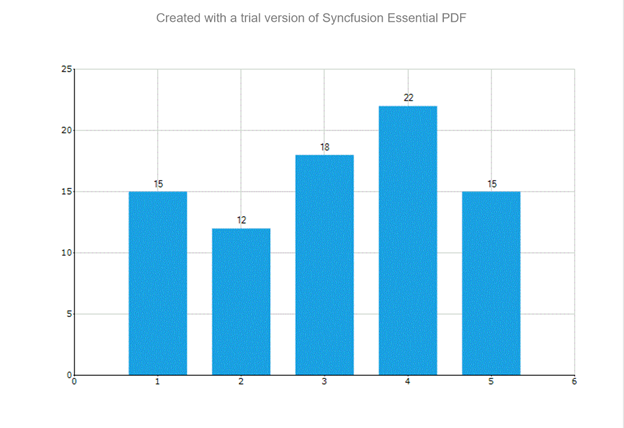

# How-to-export-the-WinForms-Chart-to-Pdf
This article explains the how to export the [Syncfusion WinForms Chart Control](https://help.syncfusion.com/windowsforms/chart/getting-started) to pdf format in as shown in the below image.
 
 
 
This has been achieved by saving chart as image and draw that image in pdf by using [PdfDocument](https://help.syncfusion.com/file-formats/pdf/nuget-packages-required) as per in below code snippet
[C#]
```
Syncfusion.Windows.Forms.Chart.ChartSeries chartSeries1 = new Syncfusion.Windows.Forms.Chart.ChartSeries();
            this.chartControl1 = new Syncfusion.Windows.Forms.Chart.ChartControl();
            …
            chartSeries1 = new ChartSeries();
            chartSeries1.Type = ChartSeriesType.Column;
            chartSeries1.Style.DisplayText = true;
            chartSeries1.Style.TextOrientation = ChartTextOrientation.Up;

            chartSeries1.Points.Add(1, 15);
            chartSeries1.Points.Add(2, 12);
            chartSeries1.Points.Add(3, 18);
            chartSeries1.Points.Add(4, 22);
            chartSeries1.Points.Add(5, 15);
            this.chartControl1.Series.Add(chartSeries1);
           
                …
          //  this.chartControl1.ShowToolbar = true;
            panel.AutoSize = true;
            panel.Controls.Add(chartControl1);
            this.Controls.Add(panel);

            string fileName = Application.StartupPath + "\\chartExport";

            string exportFileName = fileName + ".pdf";
            string file = fileName + ".gif";
            this.chartControl1.SaveImage(file);

            //Create a PDF document
            PdfDocument pdfDoc = new PdfDocument();

            //Add a page to the empty PDF document
            pdfDoc.Pages.Add();

            //Draw chart image in the first page
            pdfDoc.Pages[0].Graphics.DrawImage(PdfImage.FromFile(file), new PointF(0, 10));

            //Save the PDF Document to disk.
            pdfDoc.Save(exportFileName);

            // Launches the file.
            System.Diagnostics.Process.Start(exportFileName);

…
```

It will automatically load the export pdf but by default it will be stored in below location format

**C:\Users\{Folder}\Chart_To_PDF_WinForms\Chart_To_PDF_WinForms\bin\Debug\chartExport.pdf**


# See Also

[How to convert the chart as image in WinForms](https://help.syncfusion.com/windowsforms/chart/exporting#exporting-as-an-image)

[How to export the chart as word document in WinForms](https://help.syncfusion.com/windowsforms/chart/exporting#exporting-to-excel)

[How to export the chart as excel in WinForms](https://help.syncfusion.com/windowsforms/chart/exporting#exporting-to-excel)


 

